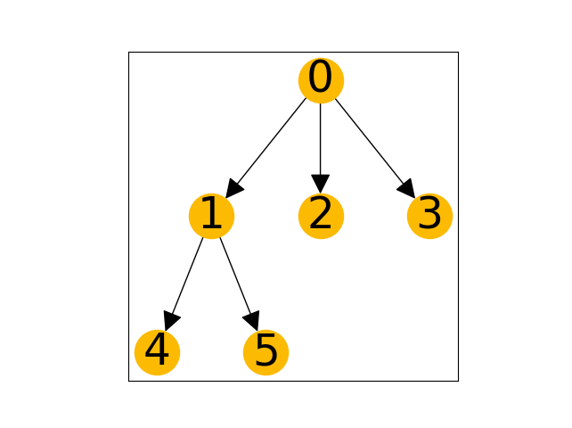
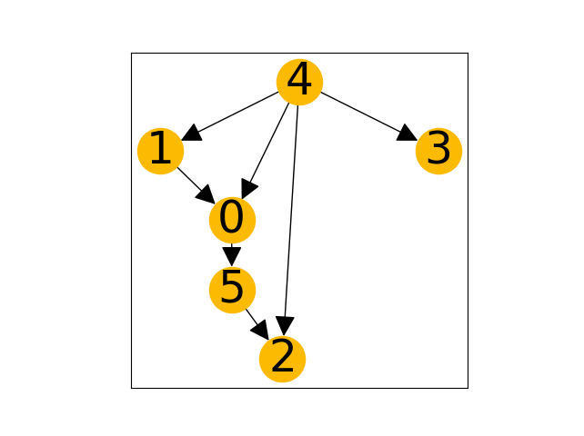
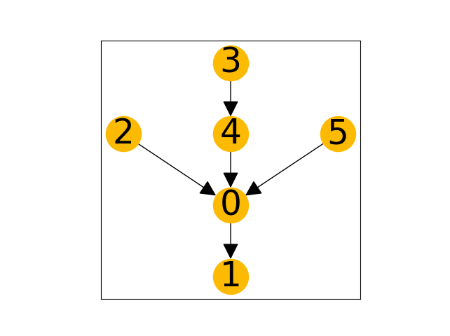

# 🦄 UniDAGs

> "*Uniformly distributed samples of directed acyclic graphs for random Bayesian Networks.*"

## Overview

Based on Ide and Cozman 2002 "*Random Generation of Bayesian Networks*." Which presented algorithms for generating random Bayesian network structures in the form of:

Trees:



Directed Acyclic Graphs:



... and Polytrees:



## Notes and Warnings

⚠️ "Algorithm 2" for random polytree generation does not match the
algorithm presented in the paper. Using it currently prints a warning to the console.

## Getting Started

This only requires `networkx>=2.5` currently:

```console
pip install -r requirements.txt
```

Methods for generating structures can be imported:

```python
>>> from unidag.generate import random_tree_graph
>>> from unidag.generate import multi_dag
>>> from unidag.generate import polytree
```

A main module provides an interface to choose (1) number of nodes, (2) number of
iterations for the Markov chain, and (3) an algorithm `{tree,polytree,graph}`.
For options and further instructions, pass a `--help` flag:

```console
python unidag/generate.py --help
```

## Acknowledgements

### BibTex

```bibtex
@inproceedings{ide2002randomgeneration,
  author="Ide, Jaime S. and Cozman, Fabio G.",
  editor="Bittencourt, Guilherme and Ramalho, Geber L.",
  title="Random Generation of Bayesian Networks",
  booktitle="Advances in Artificial Intelligence",
  year="2002",
  publisher="Springer Berlin Heidelberg",
  address="Berlin, Heidelberg",
  pages="366--376",
  isbn="978-3-540-36127-5"
}
```
